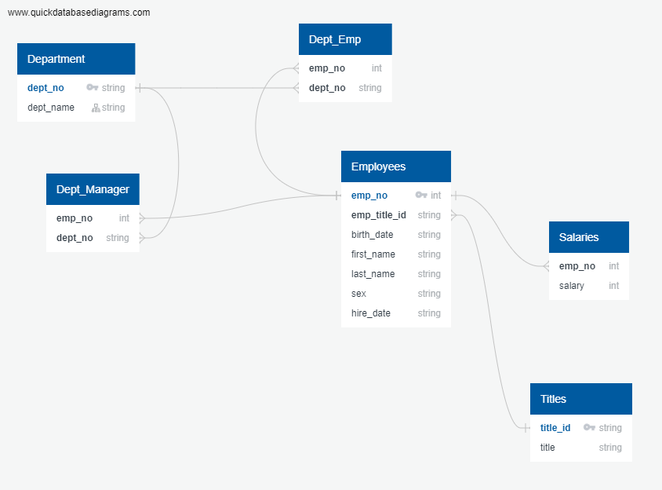

# EmployeeSQL

## Data Modeling ##

Utilizing QuickDBD, an Entity Relationship Diagram was created showing the relationships between the files.

## Data Engineering ##

Tables were created for each of the csv files that were provided. CSVs were then imported into the respective tables. The files provided are as follows:
  1. departments
  2. dept_emp
  3. dept_manager
  4. employees
  5. salaries
  6. titles

## Data Analysis ##

Queries were created to provide the following information.
  1. List the employee number, last name, first name, sex, and salary of each employee.
  2. List the first name, last name, and hire date for the employees who were hired in 1986.
  3. List the manager of each department along with their department number, department name, employee number, last name, and first name.
  4. List the department number for each employee along with that employee’s employee number, last name, first name, and department name.
  5. List first name, last name, and sex of each employee whose first name is Hercules and whose last name begins with the letter B.
  6. List each employee in the Sales department, including their employee number, last name, and first name.
  7. List each employee in the Sales and Development departments, including their employee number, last name, first name, and department name.
  8. List the frequency counts, in descending order, of all the employee last names.
